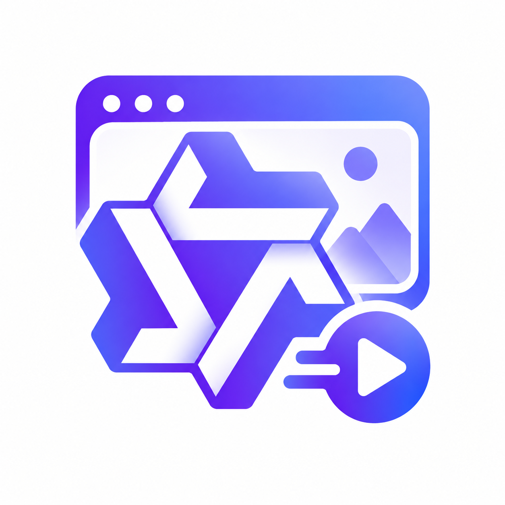
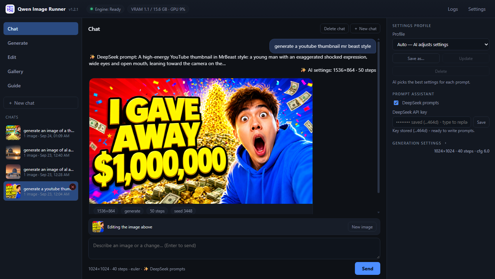
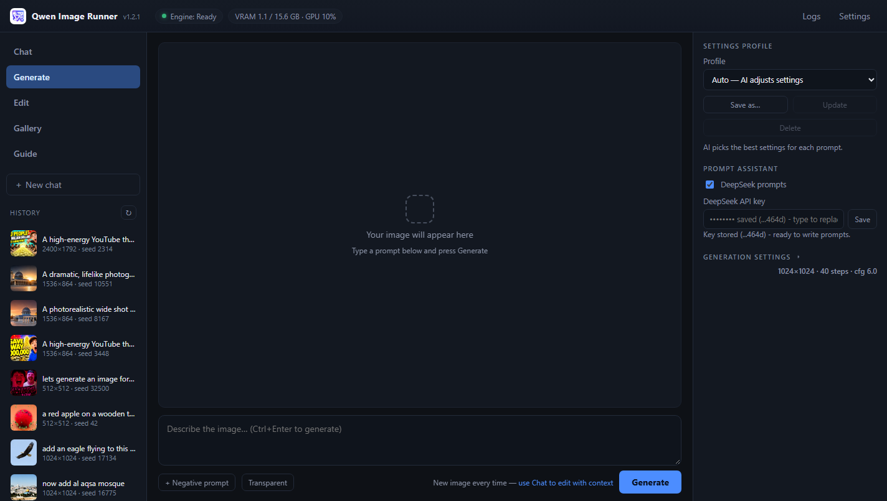
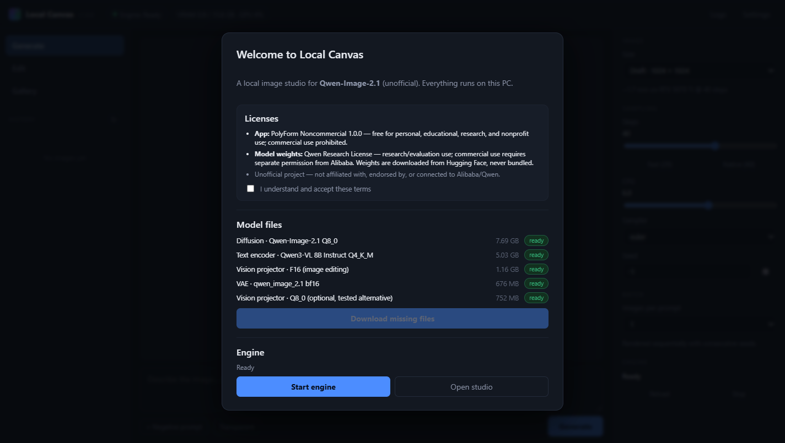
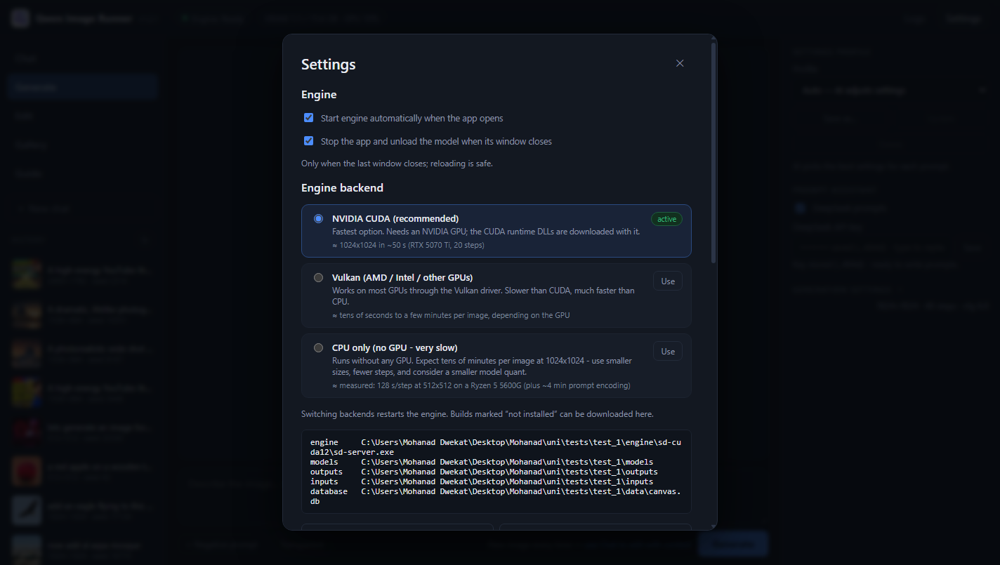

<p align="center">
  
</p>

<h1 align="center">Qwen Image Runner</h1>

<p align="center">
  A local, chat-first image generation &amp; editing studio for <b>Qwen-Image-2.1</b><br>
  runs on your own PC — NVIDIA GPU, any Vulkan GPU, or CPU only
</p>

<p align="center">
  <a href="LICENSE"></a>
  
  
  
</p>

> **This project was generated by an AI agent** (Claude running in [pi](https://github.com/badlogic/pi-mono))
> **working under human supervision and direction** — architecture, code, tests, documentation and the
> repository itself. Every feature was verified on real hardware before being claimed; measurements,
> screenshots and known limitations are recorded in [`docs/validation/`](docs/validation/).
>
> Unofficial project — not affiliated with, endorsed by, or connected to Alibaba/Qwen.



## Highlights

- **Chat-first workflow** — describe an image, then refine it in plain language. Follow-ups like
  *“make it wear sunglasses”* edit the last image and keep the scene; *“generate …”* starts a new one.
- **Multiple conversations** — `＋ New chat` opens a fresh thread; each chat keeps its messages and its
  own image folder, can be reopened from the sidebar, and can be deleted from its ✕ entry or the chat
  header — the images it created go with it, while copies you saved yourself are kept.
- **Settings profiles & Auto mode** — save named profiles of your generation defaults and switch
  between them, **Manual (current)**, or **Auto**, where the prompt assistant picks size, steps and CFG
  for every prompt (Auto starts from the app baseline: 1024×1024 · 40 steps · CFG 6).
- **Runs without a GPU** — pick CUDA, Vulkan or **CPU-only** in *Settings → Engine backend* (the app
  downloads and verifies the build you choose). The **GPU / CPU** toggle in the right-hand panel just
  switches to an installed GPU backend (CUDA preferred, then Vulkan) or CPU, and never downloads
  anything; it lives in the collapsible **Generation settings** block, which Auto collapses while the
  DeepSeek toggle stays visible. CPU mode is functional but genuinely slow (measured: 128 s/step at
  512×512) and the UI says so.
- **Prompt assistant (DeepSeek, optional)** — an expert prompt engineer in front of the image model:
  it decides new image vs edit, writes the image prompt (subject, camera, lighting, style, text
  rendering) and answers questions in the chat. Toggle it and paste your API key in the right-hand
  panel (stored locally, shown only masked; any OpenAI-compatible endpoint works).
- **Native “Save as…”** — a real Windows save dialog on every result.
- **Real progress, honest stop** — actual step count, s/it and elapsed time; queued jobs cancel
  instantly, active ones stop through an explicitly labelled engine reload.
- **Transparent PNG** output, embedded metadata, full gallery with effective parameters.
- **Guides inside the app** — the **Guide** tab renders `docs/GUIDE.md`, and `docs/INSTALL.md` covers
  prerequisites and manual installation.
- **Local-only** — binds to `127.0.0.1`, Host/Origin + CSRF protection, no telemetry.

## Screenshots

| Chat | Generate | First run | Settings |
|---|---|---|---|
|  |  |  |  |

## Install in three steps

```bat
Install.bat     REM once: venv + dependencies + engine build (checksum-verified) + desktop shortcut
Launch.bat      REM start the app (or use the "Qwen Image Runner" shortcut)
                REM first run: accept licences, pick a backend, download models (~14.6 GB), start engine
```

Full instructions, prerequisites and the manual route: **[docs/INSTALL.md](docs/INSTALL.md)**.
Using the app (chat, generate, edit, gallery, backends, troubleshooting): **[docs/GUIDE.md](docs/GUIDE.md)**.

## Requirements & dependencies

| | |
|---|---|
| OS | Windows 10 / 11 (64-bit) |
| Required | **Python 3.11+** (with “Add python.exe to PATH”) |
| Disk | ~25 GB free (engine ≈ 0.9 GB + models ≈ 14.6 GB) |
| RAM | 8 GB minimum, 16 GB+ recommended (≈13 GB peak with CUDA offload) |
| GPU | **optional** — NVIDIA (CUDA), AMD/Intel (Vulkan), or none (CPU mode) |
| Internet | only for the one-time downloads; nothing is sent afterwards |

**Python dependencies are installed automatically** by `Install.bat` into `.venv/` from
`pyproject.toml`: `fastapi`, `uvicorn[standard]`, `httpx`, `pillow`, `python-multipart` (plus `pytest`
for development). No global installs, no CUDA toolkit, no build tools.

**Model weights and the engine binary are never bundled:** the installer/app downloads them from
pinned URLs, verifies SHA-256 (`engine.json`, `models.json`) and shows the licences first.

## Compute backends

| Backend | For | Extra download | Expect |
|---|---|---|---|
| **NVIDIA CUDA** *(default)* | NVIDIA GPUs | ~0.9 GB (incl. CUDA runtime DLLs) | 1024² in ~50 s on an RTX 5070 Ti (20 steps) |
| **Vulkan** | AMD / Intel / other GPUs | ~32 MB | tens of seconds to a few minutes per image |
| **CPU** | no usable GPU | ~17 MB | **measured 128 s/step at 512×512** on a 6-core Ryzen (+ ~4 min prompt encoding) — hours per image at 1024² |

You can install several and switch instantly from **Settings → Engine backend**.

## Measured performance

RTX 5070 Ti 16 GB · CUDA backend · Q8_0 + Q4_K_M encoder · Euler · CFG 6 · CPU offload + SageAttention:

| Size | Steps | Time | Notes |
|------|-------|------|-------|
| 1024 × 1024 | 20 | ~47 s | fast preset |
| 1024 × 1024 | 40 | ~85 s | 1.94 s/it |
| 1536 × 1536 | 20 | ~101 s | 4.64 s/it |
| 2048 × 2048 | 40 | ~10.6 min | native 2K |

SageAttention gain (measured A/B): **−10 % at 1024², −30 % at 1536²**. Editing with one reference
≈ 110–214 s. Peak VRAM ≈ 12.6 GB, peak engine RAM ≈ 12.7 GiB. Full results:
[`docs/validation/v1-report.md`](docs/validation/v1-report.md).

## Architecture

```
Launch.bat → backend (FastAPI @ 127.0.0.1:7878)
               ├─ SQLite: chats, messages, images, jobs      (data/canvas.db)
               ├─ job queue → engine supervisor → sd-server   (127.0.0.1:1235)
               │     backends: engine/sd-cuda12 · sd-vulkan · sd-cpu
               ├─ real progress parsed from engine stdout
               └─ SSE → live UI updates
frontend/  vanilla ES-module UI (no build step, served by the backend)
```

| File | Purpose |
|---|---|
| `engine.json` | pinned stable-diffusion.cpp release; per-backend archives with SHA-256 |
| `models.json` | pinned model files (size, SHA-256, licence per component) |
| `backend/config.py` | paths, settings schema, backend definitions |
| `docs/GUIDE.md` · `docs/INSTALL.md` | user guide and install guide (the Guide tab renders GUIDE.md) |
| `docs/validation/` | engine + application validation reports |
| `PLAN.md` · `PLAN_V2.md` | design decisions and deferred roadmap (APIs, MCP, agents) |

## Development & tests

```bat
Install.bat
.venv\Scripts\python.exe -m pytest -q
```

No GPU or model weights needed — the suite runs against a **MockEngine** and a local fixture HTTP server.
To develop the UI on any machine:

```bat
set QIR_FAKE_ENGINE=1
.venv\Scripts\python.exe -m backend.main      REM full app with a simulated engine
```

See [CONTRIBUTING.md](CONTRIBUTING.md) — this project does not accept external contributions; you
can download, run and fork it under the license terms.

## Troubleshooting

| Symptom | Fix |
|---|---|
| Engine stuck on “Loading…” | First start reads ~13 GB from disk; later starts are seconds. |
| “Engine: Failed” | Open **Logs** — usually a missing backend build (Settings → Install) or antivirus quarantine. |
| Out of memory at 1536²/2048² | Stay at ≤1536² on 16 GB and keep CPU offload enabled (default). |
| Very slow generation | Check the active backend in the Engine panel — CPU mode is expected to be slow. |
| Port in use | App uses 7878, engine 1235. LM Studio's server uses 1234, so they coexist. |
| UI looks stale after an update | Reload once (`Ctrl+R`); the frontend is served `no-store`. |

## Known limitations (verified, intentionally not exposed)

- Mask-based local editing corrupts unmasked areas in the current engine build → no mask UI.
- RGBA inputs are flattened to RGB → transparency **output** works, transparent-layer editing does not.
- Active generation cannot be cooperatively cancelled by the engine → “Stop generation — reloads model”.
- Windows + NVIDIA/Vulkan/CPU only for now (the engine ships Linux/macOS builds; the launchers are Windows).

## License

- **App code:** [GNU GPL v3](LICENSE) — free to use, modify, fork and share. Any version you
  distribute must stay GPL-3.0 with its source available, so nobody can turn it into a closed,
  paid product. (The license does not forbid selling copies, but the source must come with them —
  which is why proprietary resale does not work in practice.)
- **Model weights:** Qwen Research License (downloaded by you at first run, never bundled).
- **Engine:** [stable-diffusion.cpp](https://github.com/leejet/stable-diffusion.cpp) (MIT).
- Third-party inventory: [THIRD_PARTY_LICENSES.md](THIRD_PARTY_LICENSES.md).

## Project origin

Qwen Image Runner was built by an AI agent under human supervision: the human set the goals, made the
product decisions and approved each step; the agent wrote the code, ran the experiments, measured the
performance, tested the UI in a real browser, and documented everything — including the parts that did
not work. If you find something broken, please open an issue.
